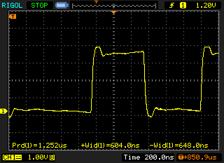

# USAGE

First you'll have to copy the credentials.h.example file to credentials.h and enter your SSID and password. Then just open up the project and upload it to your ESP8266. The (configurable) output in is GPIO 5 (or D1 on the NodeMcu v3 dev-board).

## The protocol

You can then control the led strip by sending UDP packets with the following format:

    [packet][packet]...

##### Example:

Set the first driver to magenta:

```java
byte[] packet = new byte[]{0x0, 0xFF, 0x00, 0xFF, 0xFE};
```

### LED-Set packet

This will set the colors of an LED

    [byte: ledId][byte: r][byte: g][byte: b]

### Render packet

This packet will render out the current colors to the strip and thus make changes visible, usually you'll want to send this at the end of a transmission

    [byte: 0b11111110]

As a two's complement integer: -2

As an unsigned integer: 254

## Timing

More timing information can be found in the Timing file



©2017 Yamakaja
